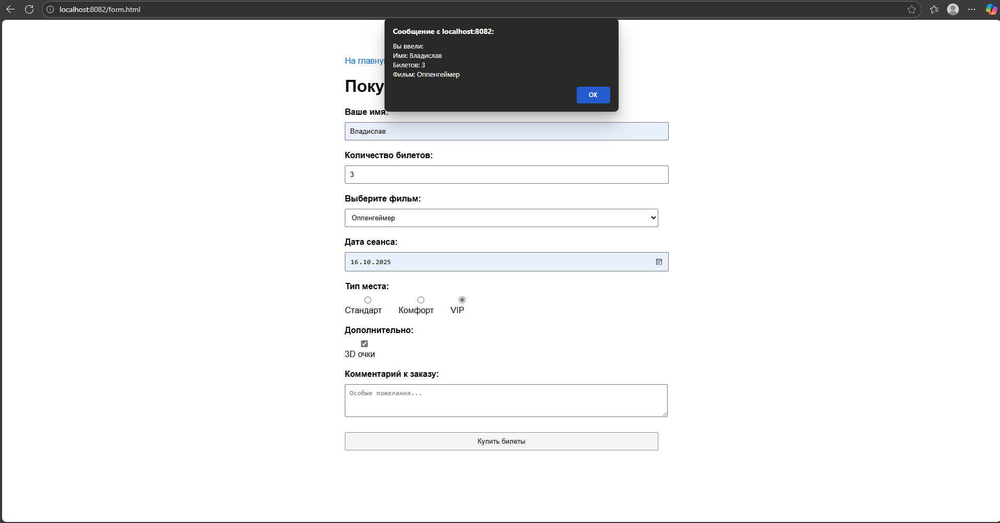

# 🎬 Лабораторная работа №3: Обработка форм на PHP + сохранение данных

## 👨‍💻 Автор
**ФИО:** Константинов Владислав Алексеевич  
**Группа:** 3МО-3 🎓

## 🎯 Цель работы
- Научиться обрабатывать данные формы на стороне сервера с помощью PHP
- Сохранять данные формы в сессии и файлах
- Реализовать валидацию данных на сервере
- Выводить сохраненные данные на отдельных страницах

## 🚀 Быстрый старт

### Предварительные требования
- Docker
- Docker Compose
- PowerShell (для Windows) или терминал (для Linux/Mac)

### Запуск проекта
\\\ash
# Клонировать репозиторий (если есть)
git clone <your-repo>
cd lab3

# Или создать структуру проекта автоматически
./create-project.ps1

# Запустить контейнеры
docker-compose up -d
\\\

## 🌐 Доступные страницы

- **Главная:** http://localhost:8082/index.php
- **Форма заказа:** http://localhost:8082/form.html  
- **Все заказы:** http://localhost:8082/view.php
- **PHP Info:** http://localhost:8082/phpinfo.php

## 📸 Скриншоты интерфейса

### Главная страница

### Форма заказа билетов

### Просмотр всех заказов

### Успешное оформление заказа

## 📁 Структура проекта

\\\
lab3/
├── docker-compose.yml          # Конфигурация Docker
├── nginx-config/
│   └── default.conf           # Конфигурация Nginx
├── www/
│   ├── index.php              # Главная страница с выводом данных из сессии
│   ├── form.html              # Форма покупки билетов (PHP обработка)
│   ├── process.php            # Обработчик формы (сессии + файл)
│   ├── view.php               # Просмотр всех заказов из файла
│   ├── phpinfo.php            # PHP информация
│   └── data.txt               # Файл с сохраненными заказами (создается автоматически)
├── screenshots/               # Скриншоты интерфейса
│   ├── main-page.png
│   ├── form-page.png
│   ├── orders-page.png
│   └── success-order.png
├── create-project.ps1         # Скрипт автоматического создания проекта
└── README.md                  # Документация
\\\

## 🔧 Функциональность

### ✅ Обработка формы на PHP
- Данные отправляются на сервер методом POST
- Валидация на стороне сервера
- Защита от XSS (htmlspecialchars)

### ✅ Сохранение в сессии
- Последний заказ сохраняется в сессии
- Вывод данных на главной странице
- Обработка ошибок валидации

### ✅ Сохранение в файл
- Все заказы сохраняются в data.txt
- Структура: время;имя;билеты;фильм;дата;место;допы;комментарий
- Просмотр всех заказов на отдельной странице

### ✅ Валидация данных
- Проверка обязательных полей
- Проверка диапазона количества билетов (1-10)
- Вывод ошибок пользователю

## 🎬 Форма покупки билетов

Форма включает следующие поля:
- 👤 **Имя пользователя** (text, обязательное)
- 🎟️ **Количество билетов** (number 1-10, обязательное) 
- 🎬 **Выбор фильма** (select, обязательное)
- 📅 **Дата сеанса** (date, обязательное)
- 💺 **Тип места** (radio buttons: Обычное, VIP, Премьер)
- 🕶️ **3D очки** (checkbox)
- 📝 **Комментарий** (textarea)

## 🔧 Технологии

- 🐳 **Docker & Docker Compose** - контейнеризация
- 🌐 **Nginx** - веб-сервер
- 🐘 **PHP 8.2 FPM + Сессии** - серверная обработка
- 📄 **HTML5 + CSS3** - клиентская часть
- 🟨 **JavaScript** - базовые уведомления

