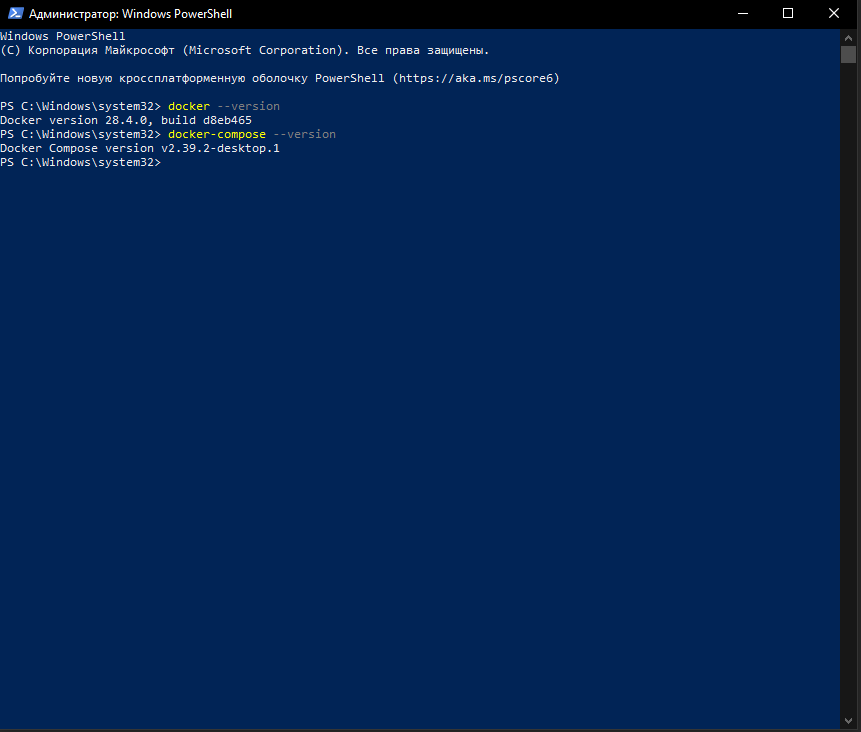
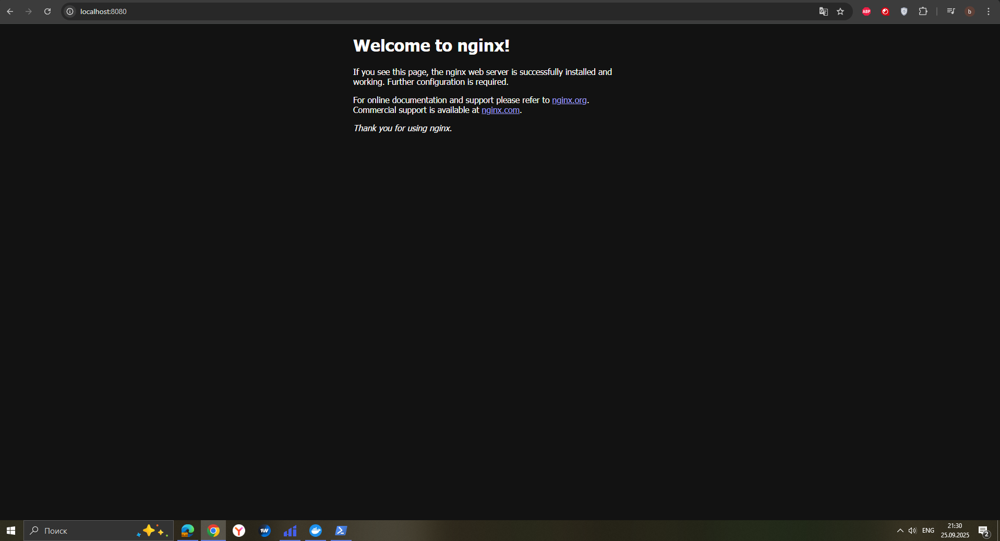
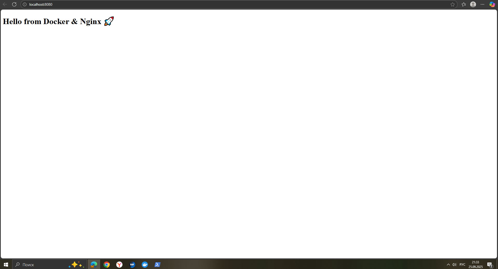
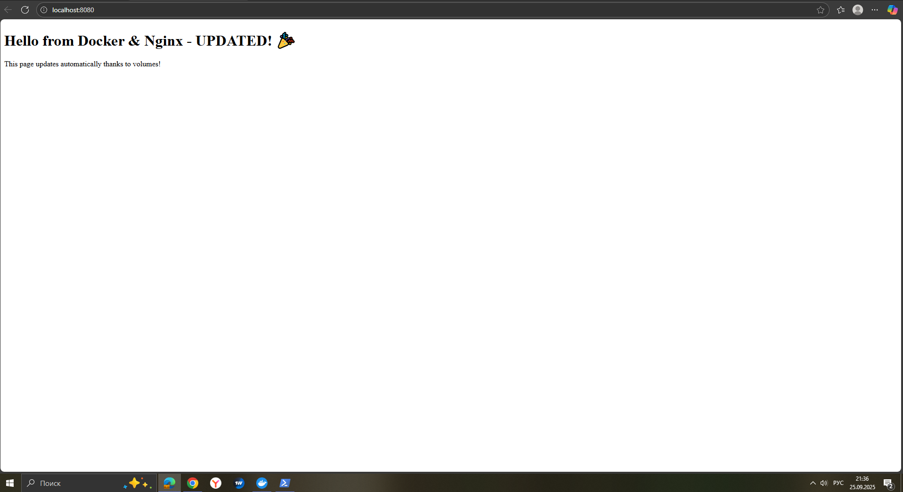
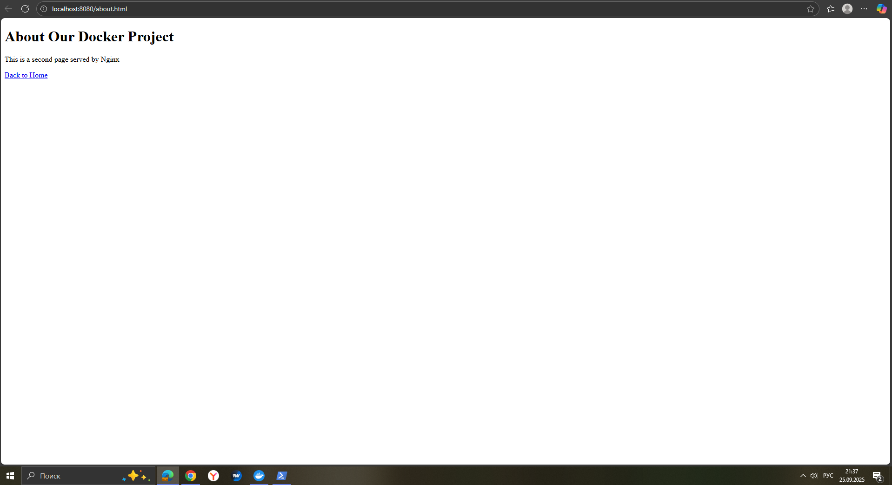
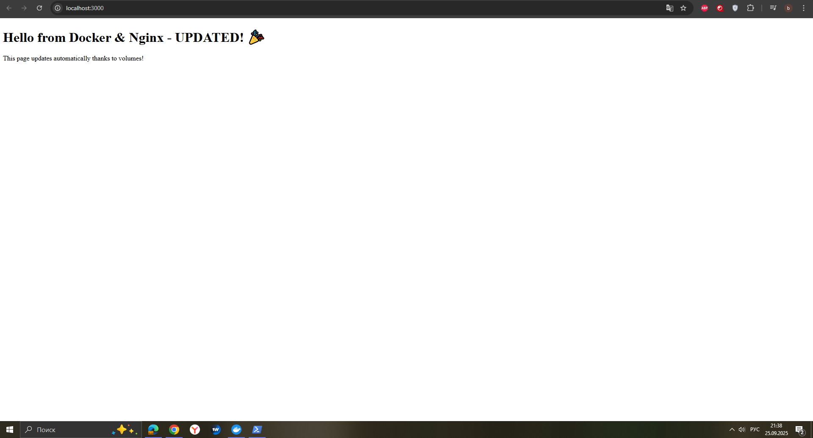

# Лабораторная работа №1: Nginx + Docker 🐳

## 👨‍💻 Автор
**ФИО:** Константинов Владислав Алексеевич  
**Группа:** 3МО-3 🎓

## 🎯 Описание задания
Создать веб-сервер в Docker с использованием Nginx и подключить HTML-страницу.  
Результат доступен по адресу [http://localhost:8080](http://localhost:8080) 🌐

## ⚡ Как запустить проект

1. **Клонировать репозиторий:**
   \\\ash
   git clone https://github.com/vlad4235/nginx-lab.git
   cd nginx-lab
   \\\

2. **Запустить контейнеры:**
   \\\ash
   docker-compose up -d
   \\\

3. **Открыть в браузере:**
   http://localhost:8080

## 📁 Структура проекта

- 🐳 \docker-compose.yml\ - конфигурация Docker Compose
- 📄 \code/index.html\ - главная HTML-страница 🏠
- 📄 \code/about.html\ - страница \"О проекте\" ℹ️
- 📸 \screenshots/\ - скриншоты работы

## 📸 Скриншоты работы

### Этап 1: 

### Этап 2:   

### Этап 3: 

### Этап 4: 
- **Этап 4.1:   

- **Этап 4.2:   

- **Этап 4.3: 

## 🎉 Результат
**Сервер в Docker успешно запущен!** ✅  
**Nginx отдаёт мою HTML-страницу!** 🌟  
**Проект полностью готов и работает!** 🏆
