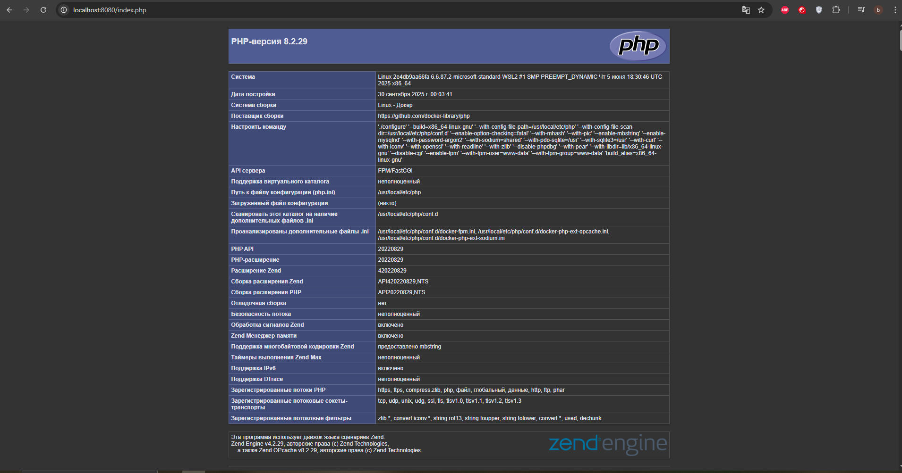
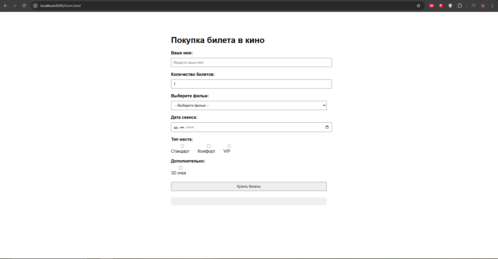

# 🎬 Лабораторная работа №2: Nginx + PHP-FPM + HTML-формы

## 👨‍💻 Автор
**ФИО:** Константинов Владислав Алексеевич  
**Группа:** 3МО-3 🎓

## 🎯 Цель работы
- Настроить веб-сервер Nginx для работы с PHP через PHP-FPM
- Освоить базовые принципы PHP (phpinfo())
- Создать HTML-форму с различными типами полей
- Реализовать обработку формы с помощью JavaScript

## 🚀 Запуск проекта

\\\ash
# Перейти в папку lab2
cd lab2

# Запустить контейнеры
docker-compose up -d
\\\

## 🌐 Доступные страницы

- **PHP Info:** http://localhost:8080/index.php
- **Форма заказа:** http://localhost:8080/form.html

## 📁 Структура проекта

\\\
lab2/
├── docker-compose.yml          # Конфигурация Docker
├── nginx-config/
│   └── default.conf           # Конфигурация Nginx
├── www/
│   ├── index.php              # PHP info страница
│   └── form.html              # Форма покупки билетов
├── screenshots/               # Скриншоты работы
│   ├── php.PNG
│   └── html.PNG
└── README.md                  # Документация
\\\

## 📸 Скриншоты работы

### Страница PHP Info

### HTML форма покупки билетов

## 🎬 Форма покупки билетов в кино

Форма включает:
- 👤 Имя пользователя (text)
- 🎟️ Количество билетов (number) 
- 🎬 Выбор фильма (select)
- 📅 Дата сеанса (date)
- 💺 Тип места (radio buttons)
- 🕶️ 3D очки (checkbox)
- 📝 Обработка на JavaScript без перезагрузки

## 🔧 Технологии

- 🐳 Docker & Docker Compose
- 🌐 Nginx
- 🐘 PHP 8.2 FPM
- 📄 HTML5
- 🟨 JavaScript
- 🎨 CSS3

## ✅ Результат

Веб-сервер успешно настроен для работы с PHP через PHP-FPM.
Реализована интерактивная форма с обработкой на JavaScript.

[🔙 Назад к списку лабораторных работ](../)
